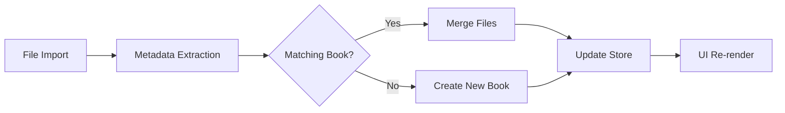

<div align="center">


# 📚 Narrivo

**A modern audiobook + eBook player with intelligent Read-Along sync**

[](LICENSE)
[](https://www.typescriptlang.org/)
[](https://reactnative.dev/)
[](CONTRIBUTING.md)

[Features](#-features) • [Tech Stack](#-tech-stack) • [Architecture](#-architecture) • [Getting Started](#-getting-started) • [Roadmap](#-roadmap)

</div>

---

## 🎯 Overview

Narrivo is an **offline-first Android app** that unifies your audiobook and eBook library with a unique **Read-Along** feature. Import your own files or explore curated public-domain classics—then experience synchronized text highlighting as you listen.

**Key Differentiators**:
- 🎵📖 **Intelligent file matching** — Import an audiobook and eBook separately; Narrivo auto-merges them for Read-Along
- 🎨 **Neo-Brutalism UI** — Bold, high-contrast design with vivid pastel accents (lime, periwinkle, pink)
- 📱 **Android-native** — Built with Scoped Storage (SAF), background audio, and lock-screen controls
- 🔒 **Privacy-first** — All files stored locally; no cloud sync, no tracking

---

## ✨ Features

### 📚 Library Management
- **Import your files** via Android file picker (MP3, M4B, EPUB, PDF)
- **Public-domain library** with one-tap downloads (Project Gutenberg, LibriVox)
- **Smart organization** by format (Audio/eBook/Hybrid) with visual badges
- **Fuzzy file matching** — Automatically links `gatsby.mp3` + `gatsby.epub` → Read-Along

### 🎧 Audio Playback
- Background playback with Android foreground service
- Lock-screen controls + notification media controls
- Variable playback speed (0.5x – 2.5x)
- Sleep timer with auto-fade
- Bookmarks with timestamps

### 📖 eBook Reader
- EPUB and PDF rendering
- Adjustable font size and theme
- Text search and annotations
- Scroll position persistence

### 🎵📖 Read-Along Mode *(Flagship Feature)*
- **Real-time text highlighting** synced with audio playback
- **Tap-to-jump** — Touch highlighted text to seek audio
- Manual sync adjustment for timing drift
- Works with user-imported or public-domain content

---

## 🛠 Tech Stack

### Core
- **React Native** — Cross-platform framework (Android-focused MVP)
- **TypeScript** — End-to-end type safety
- **Zustand** — Lightweight state management

### Android-Specific
- **Scoped Storage (SAF)** — Modern file access without legacy permissions
- **react-native-track-player** — Background audio + notification controls
- **react-native-pdf** — Native PDF rendering
- **epubjs** — EPUB parsing and rendering

### Design
- **Custom Neo-Brutalism theme** — Hand-crafted design system (no UI library)
- **Monorepo architecture** — Shared utilities, isolated components

---

## 🏗 Architecture

```
/narrivo
├── /src
│   ├── /types          # TypeScript interfaces (Book, PlayerState, etc.)
│   ├── /theme          # Neo-Brutalism design tokens
│   ├── /store          # Zustand state management
│   ├── /utils          # File matching, metadata extraction
│   ├── /services       # Audio, file picker, downloads, storage
│   ├── /screens        # Library, Reader, Read-Along, Settings
│   └── /components     # Reusable UI components
├── /android            # Native Android configuration
└── PROGRESS.md         # Development tracker
```

### State Management Flow



### File Matching Algorithm

1. **Exact Match** — Normalize title + author, compare
2. **Fuzzy Match** — Jaccard similarity on character sets (threshold: 0.7)
3. **User Confirmation** — Prompt if confidence < 0.9

---

## 🚀 Getting Started

### Prerequisites
- **Node.js** 18+ and npm
- **Android Studio** with SDK 24+ (Android 7.0)
- **React Native CLI** (`npm install -g react-native-cli`)

### Installation

```bash
# Clone the repository
git clone https://github.com/Zendevve/narrivo.git
cd narrivo

# Install dependencies
npm install

# Install Android dependencies
cd android && ./gradlew clean && cd ..

# Start Metro bundler
npm start

# Run on Android device/emulator (new terminal)
npm run android
```

### Development Commands

```bash
npm run dev          # Start Metro bundler
npm run android      # Build and run Android app
npm run lint         # Run ESLint
npm run test         # Run Jest tests
npm run build        # Production build
```

---

## 📊 Project Status

**Phase**: Core Architecture Complete (25%)

- ✅ Type system with Android-ready Book model
- ✅ Neo-Brutalism design system
- ✅ Zustand store with file merging logic
- ✅ Intelligent metadata extraction + matching
- 🚧 Services layer (audio, file picker, downloads)
- 🚧 UI components migration
- 🚧 Read-Along sync implementation

See [PROGRESS.md](PROGRESS.md) for detailed tracker.

---

## 🗺 Roadmap

### v0.1.0 — MVP (Target: Q1 2025)
- [ ] File import with SAF
- [ ] Audio playback with background support
- [ ] EPUB/PDF reader
- [ ] Basic Read-Along sync
- [ ] Public-domain starter library

### v0.2.0 — Enhanced UX
- [ ] Advanced sync calibration
- [ ] Cloud backup (optional, encrypted)
- [ ] Collections and playlists
- [ ] Metadata editing

### v1.0.0 — Public Release
- [ ] iOS version
- [ ] Accessibility improvements (screen readers, high contrast)
- [ ] Multi-language support
- [ ] Performance optimizations

---

## 🎨 Design Philosophy

Narrivo's **Neo-Brutalism aesthetic** is inspired by modern fintech SaaS apps—bold, unapologetic, and highly functional.

**Design Principles**:
- **High contrast** — Deep charcoal (#121214) + vivid accents (#CCFF00, #9999FF)
- **Hard shadows** — 4px solid black shadows (no blur)
- **All-caps typography** — Headlines use Inter Black with tight tracking
- **Rounded cards** — 24-32px border radius for tactile friendliness
- **Modular components** — Every element is a reusable design token

---

## 🤝 Contributing

Contributions are welcome! Please read [CONTRIBUTING.md](CONTRIBUTING.md) for guidelines.

**Good First Issues**:
- Add support for `.m4b` audiobooks
- Implement dark/light theme toggle
- Create unit tests for matching algorithm
- Design app icon and splash screen

---

## 📄 License

This project is licensed under the **MIT License** — see [LICENSE](LICENSE) for details.

---

## 🙏 Acknowledgments

- **LibriVox** — Public-domain audiobooks
- **Project Gutenberg** — Public-domain eBooks
- **React Native Community** — Open-source libraries and support

---

## 📬 Contact

**Author**: [Zendevve](https://github.com/Zendevve)
**Project Link**: [https://github.com/Zendevve/narrivo](https://github.com/Zendevve/narrivo)

---

<div align="center">

**⭐ Star this repo if you find it interesting!**

Made with ❤️ for audiobook and eBook enthusiasts

</div>
