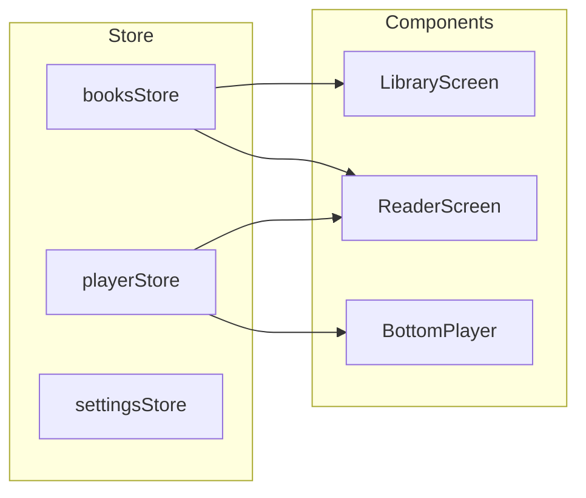
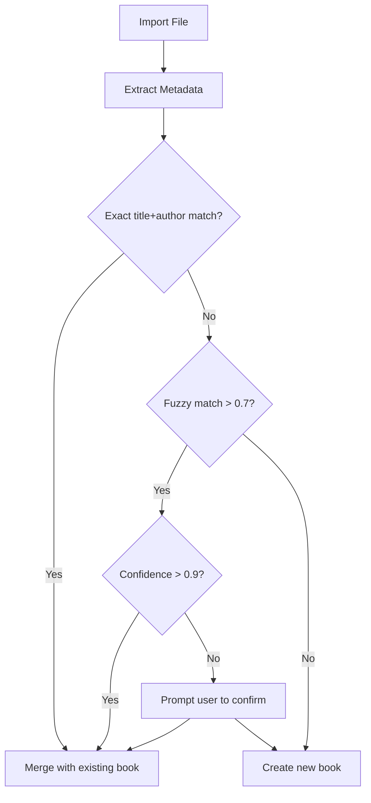

# Architecture Overview

## Monorepo Structure

```
/narrivo
├── /narrivo-expo        # Mobile app (Expo + React Native)
│   ├── /src
│   │   ├── /components  # Mobile UI components
│   │   ├── /screens     # Full-page views
│   │   ├── /services    # Audio, files, downloads
│   │   ├── /store       # Zustand state
│   │   ├── /theme       # Neo-Brutalism tokens
│   │   └── /types       # TypeScript interfaces
│   └── App.tsx          # Entry point
│
├── /src                 # Web demo (Vite + React)
│   ├── /components
│   ├── /screens
│   ├── /services
│   ├── /store
│   ├── /theme
│   └── /types
│
├── /docs                # MCAF documentation
├── AGENTS.md            # AI agent instructions
└── README.md            # Project overview
```

## State Management

Both apps use **Zustand** for state management with similar store structure:



## File Matching Algorithm

When importing files, the system matches audio + text automatically:



## Key Services

| Service | Responsibility |
|---------|---------------|
| `audioService` | Playback control, background audio |
| `fileService` | File picker, metadata extraction |
| `downloadService` | Public domain content (LibriVox/Gutenberg) |
| `storageService` | Async storage persistence |
