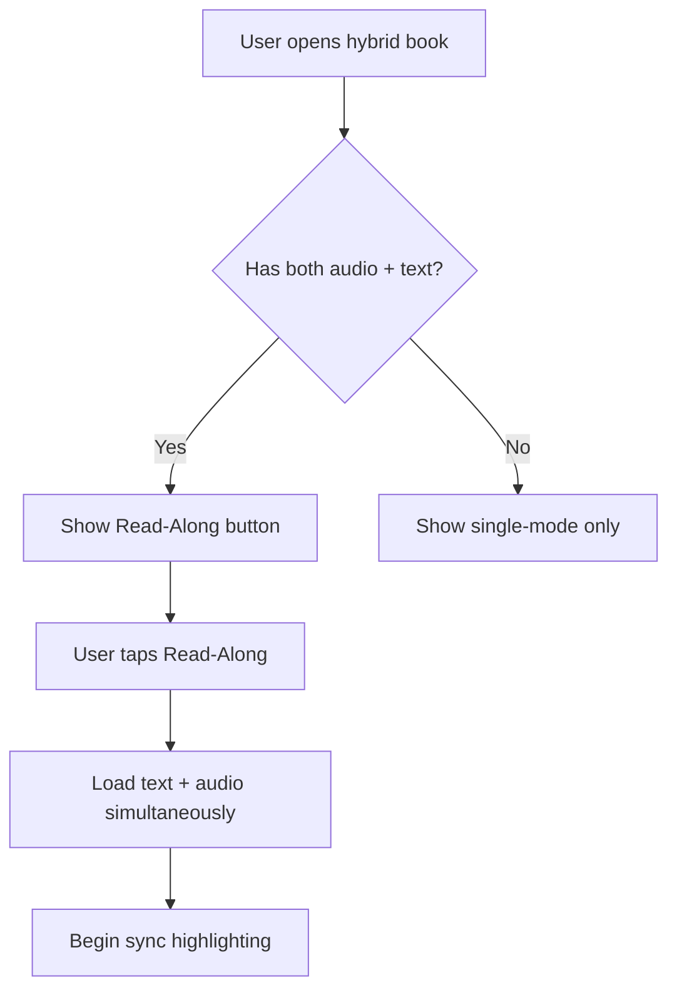

# Read-Along Mode

> 🎵📖 **Flagship Feature** — Synchronized text highlighting with audio playback

## Purpose

Read-Along mode transforms the reading experience by highlighting text in real-time as the audiobook plays. Users can follow along visually while listening, or tap any highlighted section to jump to that point in the audio.

## Business Rules

1. **File Pairing** — A book must have both audio (MP3/M4B) and text (EPUB/PDF) files
2. **Auto-Matching** — System attempts fuzzy matching of audio + text by title/author
3. **Manual Sync** — Users can adjust sync offset if timing drifts
4. **Offline-First** — Works entirely offline after files are imported

## User Flows

### Primary Flow: Starting Read-Along

### Sync Adjustment Flow

1. User notices text/audio mismatch
2. Taps sync adjustment control
3. Slides offset +/- seconds
4. System recalculates highlight timing
5. New offset persisted to book record

## Edge Cases

| Case | Behavior |
|------|----------|
| Audio longer than text | Highlight stays at end when text exhausted |
| User seeks audio | Jump to nearest text position |
| User taps text | Seek audio to estimated timestamp |
| No matching found | Prompt user to manually pair files |

## Test Flows

### T1: Basic Sync

- **Setup:** Book with audio (5 min) + EPUB
- **Steps:** Start Read-Along, let play 30 seconds
- **Expected:** Text highlights progressively, stays in sync

### T2: Tap-to-Seek

- **Setup:** Book in Read-Along mode, audio at 1:00
- **Steps:** Tap paragraph at ~2:00 mark
- **Expected:** Audio seeks to ~2:00, highlight jumps

### T3: Manual Offset

- **Setup:** Book with noticeable sync drift
- **Steps:** Adjust offset +2 seconds
- **Expected:** Highlighting corrects, offset saved

## Definition of Done

- [ ] Text highlighting updates in real-time with audio
- [ ] Tap-to-seek works within ±5 second accuracy
- [ ] Manual offset adjustment works and persists
- [ ] Works offline with local files
- [ ] Integration tests for sync accuracy
